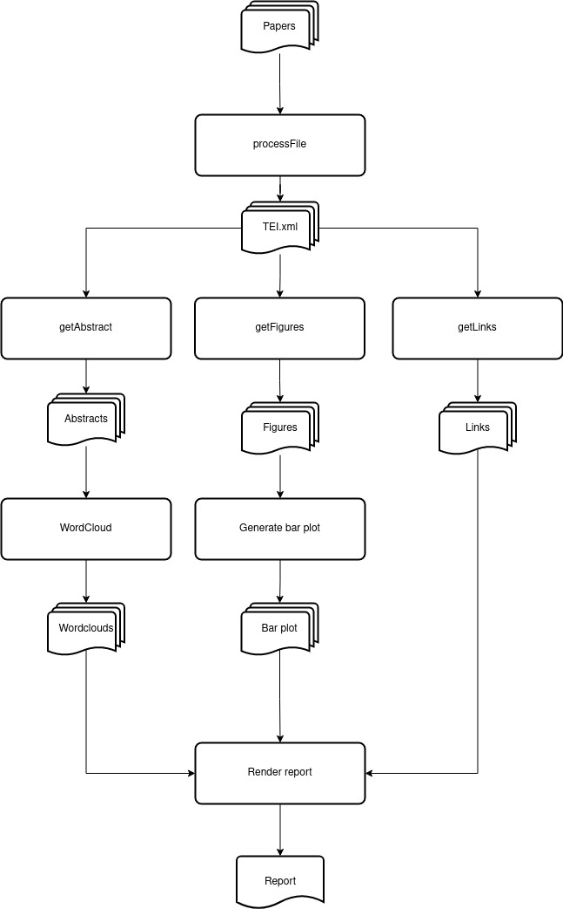

Workflow
========

The scripts follows the following workflow:

   Workflow

The ``processFile()`` function makes a post request to the grobid
service with the pdf file as the data parameter. The service then
returns the TEI.xml in the response content

After the xml has been generated, ``getAbstract()`` ``getFigures()`` and
``getLinks()`` will search inside the xml tree to find the data that
will fill our report

Using the ``WordCloud()`` class constructor and the
``matplotlib.pyplot`` module the key wordcloud and the bar plot are
generated to fill our report

Finally all data is used to fill the html templates which are merged
into one html file and rendered as a PDF with ``jinja2`` and ``pdfkit``
modules
